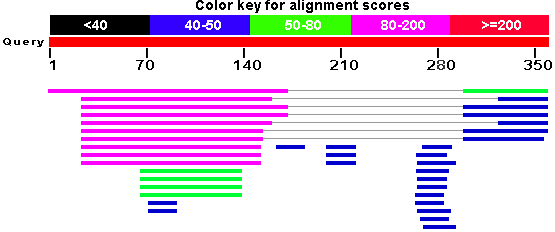

.. title: Creating graphical overview with D3
.. slug: creating-graphical-overview-with-d3
.. date: 2014-08-22 07:22:27 UTC+05:30
.. tags: sequenceserver, d3.js, jquery, javascript
.. link: 
.. description: 
.. type: text
.. author: Vivek Rai

This is a follow up of the :doc:`previous post <understanding-blast-output>`
where I was working with understanding and parsing the BLAST output data for
creating the data layer in SequenceServer. A very critical and often demanded
feature for the application was the ability to have a graphical overview of all
the obtained hits. It had been sitting on project's urgent list for quite a
long time and couldn't be delayed any longer. So, after having a discussion
with project maintainer Priyam, I assigned this task to myself.

.. TEASER_END

There were a couple of options for solving this problem.  Initially, we
considered using Scribl_, an HTML5 canvas based library written specifically for
drawing genomic regions, alignments, assembly data and so on. However, the
features and flexibility that we were looking for wasn't simply available. And
even if it was, it required a good amount of overriding on our part.

The second obvious choice was the use of d3.js_ Javascript library, a powerful
data-driven visualization generator. It's fairly low level and allows a large
degree of custom control and manipulation over components, thereby allowing
users to create rich, high quality graphics rendered in SVG_. The library can
be easily powered by the data obtained directly from the backend layer.
However, a more elegant choice was to remove this dependency on the backend and
disperse all the necessary information inside the page itself using the HTML5
data attributes. These data-attributes would then be highly useful, not only
for obtaining data but also for applying custom styling and dynamic behavior
using JS. For example, you could just do

.. code-block:: js

    /* This iterates over all elements with the mentioned data-attrib
       See public/js/jquery.graphit.js */
    $("[data-graphit='overview']").each( function(i) {
        /* Do stuff here */
    });

After the basic idea was conceived, I started playing around a little with d3
and found it quite interesting. Priyam then showed me the BLAST interface of
`naked-mole-rat.org <http://naked-mole-rat.org/blast>`_, a naked mole-rat
genome resource. They had implemented a graphical overview feature similar to
that used by NCBI except the fact that it was written using d3. 

    NCBI's graphical overview (uses tables)

Since, I was relatively new to programming in Javascript, their implementation
really helped me to think of my approach and come up with implementation of
mine. The initial code I wrote went under a lot of changes with feedback from
Priyam. Although we initially started with an inspiration from NCBI's graphical
overview (shown beside) we improved many things over theirs e.g., the hits in
our graphical overview were sorted by evalue, a gradient color scheme to
display the strength and weakness of hits etc., 

Finally,

1. Implemented the data collection using data-attribs,

.. code-block:: rhtml

    <% hit.hsps.each do |hsp| %>
      
"
          data-hsp-evalue="<%= hsp.evalue %>" data-hsp-start="<%= hsp.qstart %>"
          data-hsp-end="<%= hsp.qend %>" data-hsp-frame="<%= hsp.hframe %>">
          <table class="table-hsp">
        ..
      

2. Packed the whole code in the form of a Jquery plugin_.
#. Connected the HSPs per hit by a thin line without which the
   interpretation of results was little non obvious.

In the meantime, we were upgrading to **Bootstrap 3** which broke and re-broke
my implementation everytime. Each time, when I'll sit to rewrite the it again,
I would come up with a new and better understanding of my code. All this
however, happened only after a lot of experimentation which I didn't talk about
much in the post due to lack of time. Nevertheless, there were also a bunch of
critical bug fixes and improvements in the backend code which can be followed
here_. In the end, I feel that the newer and in development version is much
more interactive, elegant and easy to use than the previous ones. Here is a
quick snapshot of the graphical overview for a sample BLAST hit.

.. figure:: ../files/graph.png
    :align: center
    :target: ../files/graph.png
    :alt: SequenceServer's graphical overview

    SequenceServer's graphical overview (using D3)

The current source code of the plugin can be found on Github_.  Feel free to
clone and run locally on your machine. If not, an online version has also been
deployed at `antgenomes.org/sequenceserver
<http://antgeomes.org/sequenceserver>`_ for convenient testing. However, I
would like to point out that there will be a lot of planned and unplanned
changes happening frequently. So, if you plan to use SequenceServer for
production, please use `this <https://github.com/yannickwurm/sequenceserver>`_
version until we roll out refined one (very soon).

I wanted to talk more about d3 and my plans to complete a couple of data analysis projects
with its help. However, let's save it for some time later.

.. _Scribl: http://chmille4.github.io/Scribl/
.. _d3.js: http://d3js.org
.. _SVG: https://developer.mozilla.org/en/docs/Web/SVG
.. _here: https://github.com/vivekiitkgp/sequenceserver/commits/graph_fixtures
.. _plugin: https://github.com/vivekiitkgp/sequenceserver/blob/14d9febd115b02fff1a98e9659e0cb756633e9c9/public/js/jquery.graphit.js
.. _Github: https://github.com/vivekiitkgp/sequenceserver/graphic_fixtures
